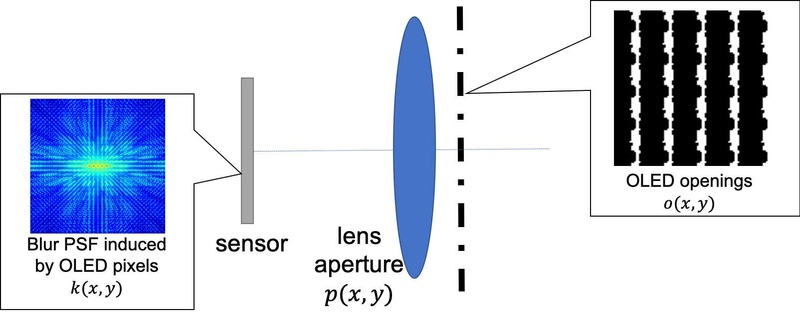

# Design Display Pixel Layouts for Under-Panel Cameras

This repository implements the experiment part of our paper "Design Display Pixel Layouts for Under-Panel Cameras", ICCP 2021, Anqi Yang and Aswin Sankaranarayanan. If you find our data and code useful, please cite our work.



**Data**: All data captured by our lab prototype can be downloaded [here (3.2G)](https://drive.google.com/file/d/1De8eouvuwsy_EODPU9bW4TrxvT_aJQDy/view?usp=sharing). We provide three folders --- five display pixel patterns, pre-measured PSFs of each display layout, and RAW images under different display layouts.

**Process RAW images**: We provide MATLAB script to process the captured RAW data and recover sharp images. The script traverses and processes RAW images of the same scene captured under various display layouts. Please edit the name of the scene in the script. For each RAW image, we process it following five steps: (1) demosaick RAW image (2) downsample demosaicked image to 1k (3) denoise (4) Wiener deblurring (5) color and gamma correction.
```
deblurReal.m
```

**Simulation**: We implement simulated experiments by MATLAB. The script compares eight different display layouts under five different SNRs. The performance is measured by PSNR and SSIM between ground-truth image and recovered sharp image on this UDC [dataset](https://yzhouas.github.io/projects/UDC/udc.html).
```
simulate.m
```

**Acknowledgement**: We use BM3D code from http://www.cs.tut.fi/~foi/GCF-BM3D/index.html#ref_software for image denoising. This work is/was supported by Global Research Outreach program of Samsung Advanced Institute of Technology.
